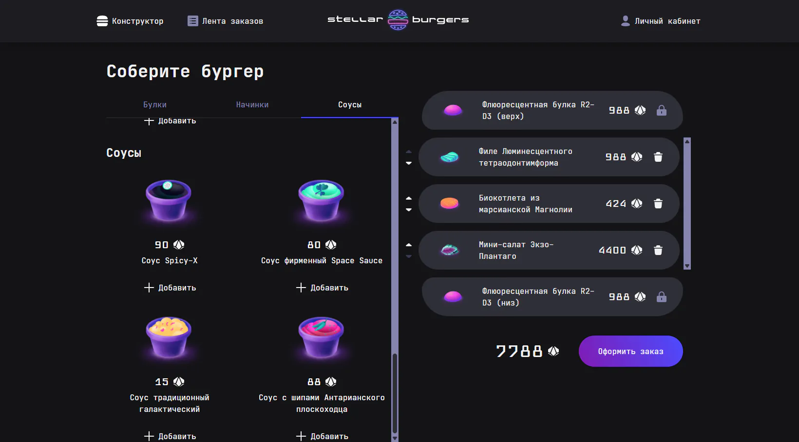

# 🍔 Stellar Burger

<div align="center">


</div>

### Превью проекта



### Интерфейс сайта

[🔗 Посмотреть демо](https://annenkov-konstantin.github.io/stellar-burgers/) • [💻 Исходный код](https://github.com/Annenkov-Konstantin/stellar-burgers)

SPA-приложение для заказа бургеров на React с использованием Redux Toolkit для управления состоянием и JWT-авторизации. Позволяет собирать бургер из ингредиентов, оформлять заказы, регистрироваться, входить в систему и просматривать историю заказов.

## 📄 Функциональность

- **Конструктор бургера** — сборка бургера из ингредиентов с drag-and-drop
- **Каталог ингредиентов** — отображение ингредиентов по категориям (булки, соусы, начинки)
- **Детали ингредиента** — просмотр подробной информации об ингредиенте в модальном окне
- **Оформление заказа** — отправка собранного бургера на сервер с получением номера заказа
- **Лента заказов** — обновление ленты заказов по запросу с отображением статистики
- **Детали заказа** — просмотр состава и статуса конкретного заказа
- **Регистрация пользователя** — создание нового аккаунта с валидацией данных
- **Авторизация** — вход в систему с JWT-токеном
- **Восстановление пароля** — сброс пароля через email
- **Профиль пользователя** — редактирование личных данных
- **История заказов** — просмотр всех заказов пользователя
- **Защищённые роуты** — доступ к профилю и истории заказов только для авторизованных пользователей
- **Модальные окна** — универсальная система модальных окон с анимацией
- **Прелоадер** — индикатор загрузки при запросах к серверу

## 🛠 Стек технологий

- **Язык:** TypeScript (строгая типизация)
- **Библиотека:** React 18 (Functional Components, Hooks)
- **State Management:** Redux Toolkit (слайсы, thunk, selector)
- **Роутинг:** React Router v6 (защищённые роуты, динамические параметры)
- **Стилизация:** CSS Modules (изоляция стилей компонентов)
- **Сборка:** Webpack (Babel, CSS loaders, dev server)
- **API:** REST API (Promise-based, с автоматическим обновлением токена)
- **Авторизация:** JWT (JSON Web Tokens) с хранением в cookies
- **Тестирование:** Jest (unit-тесты), Cypress (E2E-тесты)
- **Документация компонентов:** Storybook (интерактивная документация UI)
- **Покрытие кода:** Istanbul (отчёты о покрытии тестами)

## ✨ Ключевые особенности

### 🎨 Архитектура компонентов

- **Разделение на UI и бизнес-логику** — компоненты разделены на "умные" (pages) и "глупые" (ui)
- **Feature-based структура** — каждый компонент имеет свою папку с логикой, стилями и типами
- **Переиспользуемые UI-компоненты** — универсальные компоненты (Modal, Preloader, OrderCard)
- **TypeScript интерфейсы** — строгая типизация props, state и API-ответов
- **CSS Modules** — изоляция стилей, предотвращение конфликтов имён

### 🔄 State Management (Redux Toolkit)

- **Слайсы для каждой сущности** — ingredients, user, orders, feeds, orderDetails
- **Async Thunks** — асинхронные операции с автоматической обработкой loading/error состояний
- **Селекторы** — оптимизированный доступ к данным store
- **Нормализация данных** — эффективное хранение и обновление данных
- **Обновление по запросу** — лента заказов загружается через обычный GET-запрос

### 🛣️ Роутинг и навигация

- **React Router v6** — современный роутинг с hooks (useNavigate, useParams, useLocation)
- **Защищённые роуты** — компонент ProtectedRoute для ограничения доступа
- **Динамические роуты** — `/ingredient/:id` для деталей ингредиента, `/orders/:id` для заказа
- **Вложенные роуты** — профиль с подразделами (история заказов, редактирование)
- **404 страница** — обработка несуществующих маршрутов

### 🔐 Авторизация и безопасность

- **JWT-токены** — аутентификация через access и refresh токены
- **Cookies для access token** — токен хранится в cookie для удобства использования
- **Refresh token в localStorage** — для обновления access token при истечении
- **Автоматический refresh** — функция `fetchWithRefresh` автоматически обновляет токен при ошибке `jwt expired`
- **Защищённые роуты** — редирект на страницу логина для неавторизованных пользователей
- **Валидация форм** — проверка email, пароля, имени при регистрации и входе

### ⚡ Производительность

- **React.memo** — оптимизация перерисовки компонентов
- **useMemo и useCallback** — мемоизация вычислений и функций
- **Lazy loading** — ленивая загрузка компонентов через React.lazy
- **Skeleton-загрузчики** — устранение CLS при загрузке данных
- **Оптимистичные обновления** — мгновенное обновление UI до получения ответа сервера

### 🧪 Тестирование

- **Unit-тесты (Jest)** — тестирование Redux слайсов, утилит, хуков
- **E2E-тесты (Cypress)** — тестирование пользовательских сценариев (сборка бургера, оформление заказа)
- **Покрытие кода** — отчёты о покрытии в `coverage/` (HTML, JSON, LCOV)
- **Моки API** — изоляция тестов от реального сервера
- **Component testing** — тестирование компонентов в изоляции

### 📚 Документация компонентов (Storybook)

- **Интерактивная документация** — просмотр всех компонентов в изоляции
- **Variants** — демонстрация различных состояний компонентов
- **Controls** — изменение props в реальном времени
- **Accessibility** — проверка доступности компонентов
- **13 stories** — документация для всех ключевых компонентов

### ♿ Доступность (a11y)

- **Семантическая вёрстка** — правильная иерархия заголовков, форм, кнопок
- **Клавиатурная навигация** — управление модальными окнами, фокусом
- **ARIA-атрибуты** — роли, состояния, свойства для скринридеров
- **Focus management** — возврат фокуса после закрытия модалки
- **Контрастность** — соответствие WCAG 2.1 AA

## 🚀 Запуск

### Самый простой способ

Откройте демо-версию по ссылке: [annenkov-konstantin.github.io/stellar-burgers](https://annenkov-konstantin.github.io/stellar-burgers/)

### Локальный запуск

1. Клонируйте репозиторий:

```bash
git clone https://github.com/Annenkov-Konstantin/stellar-burgers.git
cd stellar-burgers
```

2. Установите зависимости:

```bash
npm install
```

3. Создайте файл `.env` на основе шаблона:

```bash
cp .env.example .env
```

4. Укажите URL API в `.env`:

```env
BURGER_API_URL=https://norma.nomoreparties.co/api
```

5. Запустите dev-сервер:

```bash
npm start
```

Сайт откроется по адресу `http://localhost:3000` с горячей перезагрузкой.

### Тестирование

```bash
# Unit-тесты (Jest)
npm test

# E2E-тесты (Cypress)
npm run cy:open

# Покрытие кода
npm run test:coverage
```

### Storybook

```bash
# Запуск Storybook
npm run storybook
```

Откроется по адресу `http://localhost:6006` с интерактивной документацией компонентов.

### Сборка

```bash
npm run build
```

Результат сборки будет в папке `dist/`.

### Дополнительные команды

```bash
# Проверка кода на ошибки
npm run lint

# Автоисправление ошибок линтера
npm run lint:fix

# Форматирование кода через Prettier
npm run format

# Сборка Storybook для продакшена
npm run build-storybook

# Запуск Cypress в headless-режиме
npm run cy:run

# E2E-тесты с автозапуском dev-сервера
npm run test:e2e
```

## 📁 Структура проекта

```
stellar-burgers/
├── src/
│   ├── components/              # Компоненты приложения
│   │   ├── app/                 # Корневой компонент
│   │   ├── app-header/          # Шапка с навигацией
│   │   ├── burger-constructor/  # Конструктор бургера (умный)
│   │   ├── burger-ingredients/  # Каталог ингредиентов (умный)
│   │   ├── feed-info/           # Информация о ленте заказов
│   │   ├── modal/               # Универсальное модальное окно
│   │   ├── order-card/          # Карточка заказа
│   │   ├── order-info/          # Детали заказа
│   │   ├── profile-menu/        # Меню профиля
│   │   ├── protectedRoute/      # Защищённый роут
│   │   └── ui/                  # Переиспользуемые UI-компоненты
│   │       ├── burger-constructor/
│   │       ├── burger-ingredient/
│   │       ├── modal/
│   │       ├── order-card/
│   │       ├── preloader/
│   │       └── pages/           # Страницы приложения
│   │           ├── constructor-page/
│   │           ├── feed/
│   │           ├── login/
│   │           ├── profile/
│   │           └── register/
│   ├── pages/                   # Страницы (контейнеры)
│   │   ├── constructor-page/    # Главная страница (конструктор)
│   │   ├── feed/                # Лента заказов
│   │   ├── ingredient-page/     # Детали ингредиента
│   │   ├── login/               # Страница входа
│   │   ├── profile/             # Профиль пользователя
│   │   ├── profile-orders/      # История заказов
│   │   ├── register/            # Регистрация
│   │   └── not-fount-404/       # 404 страница
│   ├── services/                # Redux store и слайсы
│   │   ├── slices/
│   │   │   ├── ingredients.ts   # Слайс ингредиентов
│   │   │   ├── user.ts          # Слайс пользователя
│   │   │   ├── orders.ts        # Слайс данных заказа
│   │   │   ├── feeds.ts         # Слайс ленты заказов
│   │   │   ├── orderDetails.ts  # Слайс деталей заказа
│   │   │   └── userOrders.ts    # Слайс заказов пользователя
│   │   └── store.ts             # Конфигурация Redux store
│   ├── hooks/                   # Кастомные хуки
│   │   ├── use-typed-location.ts
│   │   └── useForm.ts
│   ├── utils/                   # Утилиты
│   │   ├── burger-api.ts        # API-запросы к серверу
│   │   ├── cookie.ts            # Работа с cookies
│   │   ├── types.ts             # TypeScript типы
│   │   └── validators.ts        # Валидация форм
│   ├── stories/                 # Storybook stories
│   │   ├── BurgerConstructor.stories.ts
│   │   ├── BurgerIngredient.stories.tsx
│   │   ├── OrderCard.stories.ts
│   │   └── ...
│   ├── __tests__/               # Unit-тесты (Jest)
│   │   ├── ingredients.test.ts
│   │   ├── user.test.ts
│   │   ├── rootReducer.test.ts
│   │   └── ...
│   └── index.tsx                # Точка входа
├── cypress/                     # E2E-тесты (Cypress)
│   ├── e2e/
│   │   └── constructor.cy.tsx
│   ├── fixtures/                # Моки данных
│   └── support/
├── coverage/                    # Отчёты о покрытии кода
├── .storybook/                  # Конфигурация Storybook
├── public/                      # Статические файлы
├── .env                         # Переменные окружения (не коммитится)
├── .env.example                 # Шаблон .env
├── package.json
├── tsconfig.json
├── webpack.config.js
├── jest.config.ts
├── cypress.config.ts
└── README.md
```

## 🧠 Архитектурные решения

### Разделение на UI и бизнес-логику

Компоненты разделены на два слоя:

**UI-компоненты** (`components/ui/`):

- "Глупые" компоненты, отвечающие только за отображение
- Получают данные через props
- Не знают о Redux, API, роутинге
- Легко переиспользуются и тестируются

**Бизнес-компоненты** (`components/` и `pages/`):

- "Умные" компоненты, связывающие UI с данными
- Подключены к Redux store через `useSelector` и `useDispatch`
- Обрабатывают пользовательские действия
- Делегируют отображение UI-компонентам

### Redux Toolkit Architecture

**Слайсы (slices):**

- **`ingredients.ts`** — загрузка и хранение ингредиентов
- **`user.ts`** — регистрация, авторизация и данные пользователя
- **`orders.ts`** — создание и управление данными заказа
- **`feeds.ts`** — лента всех заказов с общей статистикой
- **`orderDetails.ts`** — детали заказов из общей ленты
- **`userOrders.ts`** — список заказов текущего пользователя

### Автоматическое обновление JWT-токена

Реализована функция `fetchWithRefresh`, которая автоматически обновляет access token при истечении:

```typescript
const fetchWithRefresh = async <T>(url: RequestInfo, options: RequestInit) => {
  try {
    const res = await fetch(url, options);
    return await checkResponse<T>(res);
  } catch (err) {
    if ((err as { message: string }).message === 'jwt expired') {
      const refreshData = await refreshToken();
      if (options.headers) {
        (options.headers as { [key: string]: string }).authorization =
          refreshData.accessToken;
      }
      const res = await fetch(url, options);
      return await checkResponse<T>(res);
    } else {
      return Promise.reject(err);
    }
  }
};
```

### Защищённые роуты

- `/profile` — профиль пользователя
- `/profile/orders` — история заказов
- `/profile/orders/:number` — детали конкретного заказа

## 📊 API Endpoints

### Аутентификация

| Метод | Эндпоинт                | Описание                        |
| ----- | ----------------------- | ------------------------------- |
| POST  | `/auth/register`        | Регистрация пользователя        |
| POST  | `/auth/login`           | Вход в систему                  |
| POST  | `/auth/logout`          | Выход из системы                |
| POST  | `/auth/token`           | Обновление access token         |
| GET   | `/auth/user`            | Получение данных пользователя   |
| PATCH | `/auth/user`            | Обновление данных пользователя  |
| POST  | `/password-reset`       | Запрос на восстановление пароля |
| POST  | `/password-reset/reset` | Сброс пароля по токену          |

### Ингридиенты и заказы

| Метод | Эндпоинт          | Описание                       |
| ----- | ----------------- | ------------------------------ |
| GET   | `/ingredients`    | Получение списка ингредиентов  |
| POST  | `/orders`         | Создание нового заказа         |
| GET   | `/orders`         | Получение заказов пользователя |
| GET   | `/orders/all`     | Получение ленты всех заказов   |
| GET   | `/orders/:number` | Получение заказа по номеру     |

## 🧪 Тестирование

### Unit-тесты (Jest)

**Покрытие кода:**

- ✅ Redux слайсы (ingredients, user, orders, feeds)
- ✅ Утилиты (cookie, validators)
- ✅ Хуки (useForm)
- ✅ Root reducer

**Запуск тестов:**

```bash
npm test
```

### E2E-тесты (Cypress)

**Тестируемые сценарии:**

- ✅ Сборка бургера из ингредиентов
- ✅ Drag-and-drop ингредиентов
- ✅ Оформление заказа
- ✅ Открытие модального окна с деталями заказа
- ✅ Подсчёт общей стоимости

```bash
npm run cy:open
```

## 📚 Storybook

**Документация компонентов:**

- BurgerConstructor
- BurgerIngredient
- BurgerConstructorElement
- FeedInfo
- Header
- IngredientDetails
- OrderCard
- OrderDetails
- OrderInfo
- OrderStatus
- Preloader
- ProfileMenu

**Запуск Storybook:**

```bash
npm run storybook
```

## 🔒 Безопасность и конфигурация

- **Переменные окружения** — URL API вынесен в `.env` файл
- **JWT токены** — access token в cookies, refresh token в localStorage
- **Автоматический refresh** — функция `fetchWithRefresh` обновляет токен при истечении
- **Защищённые роуты** — ограничение доступа к профилю и истории заказов
- **Валидация форм** — проверка email, пароля, имени при регистрации
- **CORS** — настройка cross-origin запросов

## 📚 Источники и оригинальный репозиторий

ℹ️ **Примечание:** Этот репозиторий содержит код проекта, перенесённый для удобства демонстрации в портфолио. Частичная история разработки доступна в [оригинальном репозитории](https://github.com/Annenkov-Konstantin/stellar-burgers).

## 📬 Контакты

Если у вас есть вопросы по проекту или вы хотите сотрудничать:

- **Сайт:** [pheb.ru](https://pheb.ru/)
- **Email:** pheb@list.ru
- **Telegram:** [@Knfrei](https://t.me/Knfrei)
- **GitHub:** [@Annenkov-Konstantin](https://github.com/Annenkov-Konstantin)

---

<div align="center">

**Если проект был полезен, поставьте ⭐ на GitHub!**

</div>

---
